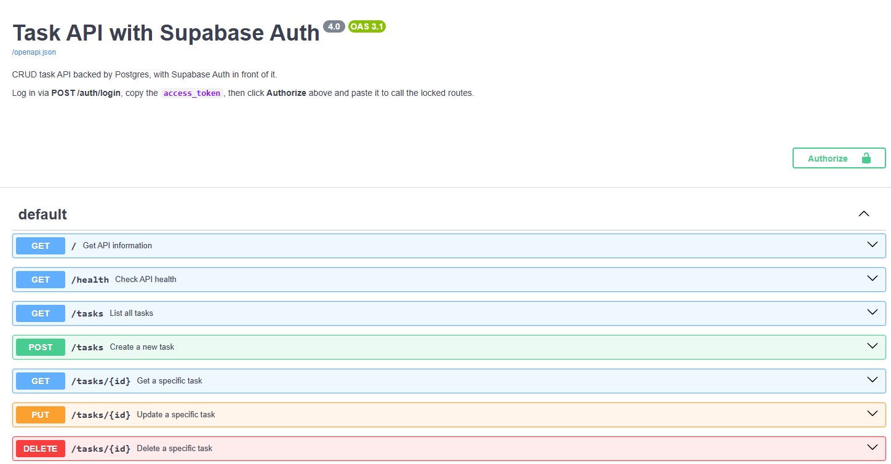
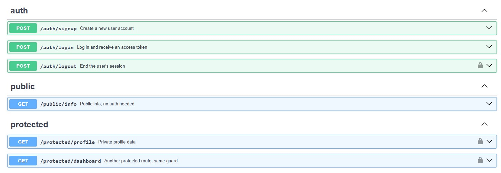

# Task API — FlyRank Backend Track (A1 · A2 · A3 · A4)

A small CRUD API for managing a to-do list, built with **Python** and **FastAPI**, now with
**Supabase Auth** in front of it: sign up, log in, log out, and routes that answer only for
logged-in users. The storage underneath has been swapped three times while the API on top stayed
identical:

| Assignment | Where tasks live | What runs it |
|---|---|---|
| A1 | a list in memory | your program |
| A2 | a `tasks.db` file | your disk (SQLite) |
| **A3 (current)** | **rows in Postgres** | **a container — a real database server** |

Identical endpoints and identical responses across all three: storage is just an implementation detail.

## Run it — one command

**Requirements:** Docker Desktop (or Podman).

```bash
cp .env.example .env
docker compose up
```

That starts two containers: `api` (built from the `Dockerfile`) and `db` (the official `postgres`
image with a named volume). The API is at <http://localhost:3000>, interactive docs at
<http://localhost:3000/docs>. The `tasks` table is created automatically if missing and three example
tasks are seeded **only when the table is empty** — restarts never duplicate them.

Data lives in the `taskdata` volume, so `docker compose down` then `up` keeps every row.

### Configuration

All config comes from the environment — see `.env.example` for the keys:

| Variable | What it is |
|---|---|
| `DATABASE_URL` | Postgres connection string, e.g. `postgres://postgres:dev@db:5432/tasks` |
| `SUPABASE_URL` | Your Supabase Project URL (Dashboard → Project Settings → API) |
| `SUPABASE_KEY` | Your Supabase **anon** key — never the `service_role` key |
| `PORT` | Port the API listens on (default `3000`) |

`.env` is git-ignored and holds the real values; `.env.example` is the committed template.
No credentials are hardcoded anywhere in the code.

### Running the app outside Docker

Start just the database, then run the app on your machine against it:

```bash
docker run --name taskdb -e POSTGRES_PASSWORD=dev -e POSTGRES_DB=tasks \
  -p 5432:5432 -v taskdata:/var/lib/postgresql -d postgres
pip install -r requirements.txt
uvicorn main:app --reload --port 3000     # DATABASE_URL points at localhost in .env
```

Open a SQL prompt inside the container: `docker exec -it taskdb psql -U postgres -d tasks`

> The assignment mounts the volume at `/var/lib/postgresql/data`. The `postgres:18+` images expect a
> single mount at `/var/lib/postgresql` instead, which is what the commands above use.

## Endpoints

| Method | Path | Auth | Description | Status codes |
|--------|------|------|-------------|--------------|
| POST | `/auth/signup` | none | Create a user account | 201, 400 missing email/password |
| POST | `/auth/login` | none | Log in, returns an access token | 200, 400 missing input, 401 bad credentials |
| POST | `/auth/logout` | **Bearer** | End the session | 204, 401 missing/invalid token |
| GET | `/protected/profile` | **Bearer** | Private profile data | 200, 401 missing/invalid token |
| GET | `/protected/dashboard` | **Bearer** | Second protected route, same guard | 200, 401 missing/invalid token |
| GET | `/public/info` | none | Public info | 200 |

Task routes (from A1–A3), all currently open:

| Method | Path | Description | Status codes |
|--------|------|-------------|--------------|
| GET | `/` | API info | 200 |
| GET | `/health` | Health check | 200 |
| GET | `/tasks` | List all tasks | 200 |
| POST | `/tasks` | Create a new task | 201, 400 empty/missing title |
| GET | `/tasks/{id}` | Get a specific task | 200, 404 unknown id |
| PUT | `/tasks/{id}` | Update a specific task (title and/or done) | 200, 400 empty title, 404 unknown id |
| DELETE | `/tasks/{id}` | Delete a specific task | 204, 404 unknown id |

All error responses return JSON in the form `{"error": "..."}`.

## Example request

```bash
curl -i http://localhost:3000/tasks
```

```
HTTP/1.1 200 OK
date: Thu, 13 Aug 2026 18:38:14 GMT
server: uvicorn
content-length: 191
content-type: application/json

[{"id":1,"title":"Buy milk","done":false},{"id":2,"title":"Walk the dog","done":false},{"id":3,"title":"Finish assignment","done":false},{"id":4,"title":"Survives compose down","done":false}]
```

Creating a task:

```bash
curl -i -X POST http://localhost:3000/tasks -H "Content-Type: application/json" -d '{"title":"Buy milk"}'
```

```
HTTP/1.1 201 Created
content-type: application/json

{"id":4,"title":"Buy milk","done":false}
```

## Auth: how it works (A4)

Authentication is a trust triangle — the client, this API, and **Supabase** as the Identity Provider.
Supabase stores the accounts, hashes the passwords, and signs the tokens. This API never stores a
password and never hashes anything itself; it forwards credentials to Supabase and **verifies the
tokens** Supabase hands back.

1. Client sends email + password to `POST /auth/signup` or `POST /auth/login`.
2. Supabase checks them and returns a **JWT** (the `access_token`) plus a refresh token.
3. Client calls a protected route with `Authorization: Bearer <token>`.
4. The guard asks Supabase whether the token is real — `supabase.auth.get_user(token)`, a network
   call — and only then does the route body run.

The guard lives in `auth.py` as `current_user`, a FastAPI **dependency**. Protecting a new route
means adding `Depends(current_user)` — no auth code is ever copy-pasted:

```python
@app.get("/protected/dashboard")
async def protected_dashboard(user=Depends(current_user)):
    return {"message": f"Welcome back, {user.email}"}
```

Errors it returns: `401 {"error": "Access token required"}` when the header is missing or malformed,
`401 {"error": "Invalid or expired token"}` when Supabase rejects the token.

### The full flow with curl

```bash
# 1. sign up
curl -i -X POST http://localhost:3000/auth/signup \
  -H "Content-Type: application/json" \
  -d '{"email":"you@example.com","password":"password123"}'          # -> 201

# 2. log in and keep the token
TOKEN=$(curl -s -X POST http://localhost:3000/auth/login \
  -H "Content-Type: application/json" \
  -d '{"email":"you@example.com","password":"password123"}' \
  | sed -n 's/.*"access_token":"\([^"]*\)".*/\1/p')

# 3. the locked door opens
curl -i http://localhost:3000/protected/profile -H "Authorization: Bearer $TOKEN"
# -> 200 {"id":"58a0c788-...","email":"you@example.com","created_at":"..."}

# 4. tamper with the token -> the guard refuses
curl -i http://localhost:3000/protected/profile -H "Authorization: Bearer ${TOKEN}tampered"
# -> 401 {"error":"Invalid or expired token"}

# 5. no token at all
curl -i http://localhost:3000/protected/profile          # -> 401 {"error":"Access token required"}
```

> Tampering note: change a character in the **middle** of the token. Replacing the very last
> character of the signature can decode to the same bytes (it carries only two significant bits), so
> the token is not actually altered and verification still succeeds.

### Swagger UI

Open <http://localhost:3000/docs>: the protected routes show a **lock icon**. Click **Authorize**,
paste the `access_token` from `/auth/login`, and use **Try it out** on `GET /protected/profile` —
no curl needed. FastAPI's `HTTPBearer` scheme is what puts the padlock there.



The padlock appears on exactly the three routes behind the guard — `/auth/logout`,
`/protected/profile` and `/protected/dashboard` — while `/auth/signup`, `/auth/login` and
`/public/info` stay open:



### Supabase project setup

1. Create a free project at [supabase.com](https://supabase.com).
2. **Project Settings → API**: copy the Project URL and the **anon** key into your `.env`.
3. **Authentication → Sign In / Providers → Email**: turn **"Confirm email" off** for local practice,
   otherwise a fresh signup cannot log in until it clicks a confirmation email. (In production you
   leave this on — it is a real security feature.)

## The data in the database

Task #4 below was created through the API, survived a full `docker compose down` and `up`, and is
read straight out of Postgres:

```
$ docker compose exec db psql -U postgres -d tasks -c "\dt" -c "SELECT * FROM tasks;"
          List of tables
 Schema | Name  | Type  |  Owner
--------+-------+-------+----------
 public | tasks | table | postgres
(1 row)

 id |         title         | done
----+-----------------------+------
  1 | Buy milk              | f
  2 | Walk the dog          | f
  3 | Finish assignment     | f
  4 | Survives compose down | f
(4 rows)
```

## How it is put together

| File | What it does |
|---|---|
| `main.py` | FastAPI routes and validation — unchanged in shape since A1 |
| `auth.py` | Supabase client and `current_user`, the reusable guard on protected routes |
| `storage.py` | The one module that talks to Postgres; every query is parameterized (`%s`) |
| `Dockerfile` | Builds the app image |
| `compose.yaml` | Starts `api` + `db` together, with a volume and a database healthcheck |
| `database.py`, `sql_playground.py` | The A2 SQLite storage layer and its by-hand SQL, kept for reference |

## SQLite → Postgres: what actually changed

`database.py` (A2) and `storage.py` (A3) do the same job for different engines. Both files are in the
repo so the swap is visible:

| | `database.py` (A2, SQLite) | `storage.py` (A3, Postgres) |
|---|---|---|
| Engine | a file on disk, `tasks.db` | a server running in a container |
| Driver | `sqlite3` (Python standard library) | `psycopg` |
| Where it connects | hardcoded filename | `DATABASE_URL` read from `.env` |
| Placeholder | `?` | `%s` |
| Auto id | `INTEGER PRIMARY KEY AUTOINCREMENT` | `SERIAL PRIMARY KEY` |
| Booleans | no boolean type — `done` stored as `0`/`1` and cast on read | real `BOOLEAN`, returns `True`/`False` |
| Id of a new row | `cursor.lastrowid` after the insert | `INSERT ... RETURNING id, title, done` |
| Transactions | manual `conn.commit()` and `conn.close()` | the `with` block commits and closes |
| Scope | connection + table creation only; the routes wrote their own SQL | all of CRUD lives here |

That last row is the structural change. In A2 the SQL was scattered through the route bodies in
`main.py`; A3 keeps every database line in one module, so `main.py` only handles HTTP — validation and
status codes. Swapping SQLite for Postgres therefore touched zero route logic.

**Why that matters:** the same requests returned the same responses with the same status codes against
all three storage engines — an in-memory list, a SQLite file, and a Postgres server. If behaviour
visible to a client never changed while the engine underneath changed twice, then storage really is
"just an implementation detail": the API is the promise, and the database is only where the promise
happens to be kept.

## Previous assignment — A2 (SQLite)

Why SQLite was chosen back then: one file, zero setup, no server to run — and it already gave
persistence across restarts. `tasks.db` is created automatically by `init_db()` in `database.py` and
is git-ignored so a clean clone starts fresh.

SQL run by hand in DB Browser for SQLite (the same queries live in `sql_playground.py`):

```sql
SELECT * FROM tasks WHERE done = 1;
```

It returned only the completed rows — after `UPDATE tasks SET done = 1 WHERE id = 1;` the row
`(1, 'Buy milk', 1)` appeared, and `GET /tasks` showed `"done": true` immediately, with no server
restart: the API and DB Browser read the exact same file.


## Notes

- Postgres runs in a container; nothing is installed on the host.
- The database password comes from the environment, never from the source code.
- All CRUD operations use **parameterized queries** (`%s` placeholders in psycopg); no user input is
  ever glued into a SQL string.
- Validation is unchanged from A1/A2: a missing or empty `title` is a `400`, an unknown id is a `404`.
