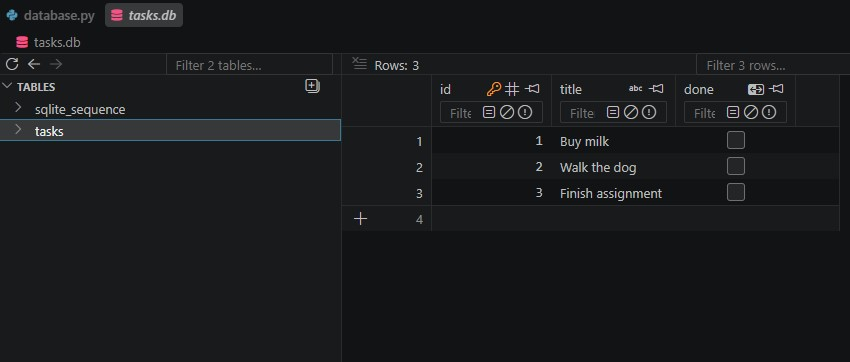

# Task API — FlyRank Backend Track (A1 · A2 · A3)

A small CRUD API for managing a to-do list, built with **Python** and **FastAPI**. Supports creating,
reading, updating, and deleting tasks. The storage underneath has been swapped three times while the
API on top stayed identical:

| Assignment | Where tasks live | What runs it |
|---|---|---|
| A1 | a list in memory | your program |
| A2 | a `tasks.db` file | your disk (SQLite) |
| **A3 (current)** | **rows in Postgres** | **a container — a real database server** |

Identical endpoints and identical responses across all three: storage is just an implementation detail.

## Run it — one command

**Requirements:** Docker Desktop (or Podman).

```bash
cp .env.example .env
docker compose up
```

That starts two containers: `api` (built from the `Dockerfile`) and `db` (the official `postgres`
image with a named volume). The API is at <http://localhost:3000>, interactive docs at
<http://localhost:3000/docs>. The `tasks` table is created automatically if missing and three example
tasks are seeded **only when the table is empty** — restarts never duplicate them.

Data lives in the `taskdata` volume, so `docker compose down` then `up` keeps every row.

### Configuration

All config comes from the environment — see `.env.example` for the keys:

| Variable | What it is |
|---|---|
| `DATABASE_URL` | Postgres connection string, e.g. `postgres://postgres:dev@db:5432/tasks` |

`.env` is git-ignored and holds the real values; `.env.example` is the committed template.
No credentials are hardcoded anywhere in the code.

### Running the app outside Docker

Start just the database, then run the app on your machine against it:

```bash
docker run --name taskdb -e POSTGRES_PASSWORD=dev -e POSTGRES_DB=tasks \
  -p 5432:5432 -v taskdata:/var/lib/postgresql -d postgres
pip install -r requirements.txt
uvicorn main:app --reload --port 3000     # DATABASE_URL points at localhost in .env
```

Open a SQL prompt inside the container: `docker exec -it taskdb psql -U postgres -d tasks`

> The assignment mounts the volume at `/var/lib/postgresql/data`. The `postgres:18+` images expect a
> single mount at `/var/lib/postgresql` instead, which is what the commands above use.

## Endpoints

| Method | Path | Description | Status codes |
|--------|------|-------------|--------------|
| GET | `/` | API info | 200 |
| GET | `/health` | Health check | 200 |
| GET | `/tasks` | List all tasks | 200 |
| POST | `/tasks` | Create a new task | 201, 400 empty/missing title |
| GET | `/tasks/{id}` | Get a specific task | 200, 404 unknown id |
| PUT | `/tasks/{id}` | Update a specific task (title and/or done) | 200, 400 empty title, 404 unknown id |
| DELETE | `/tasks/{id}` | Delete a specific task | 204, 404 unknown id |

All error responses return JSON in the form `{"error": "..."}`.

## Example request

```bash
curl -i http://localhost:3000/tasks
```

```
HTTP/1.1 200 OK
date: Thu, 13 Aug 2026 18:38:14 GMT
server: uvicorn
content-length: 191
content-type: application/json

[{"id":1,"title":"Buy milk","done":false},{"id":2,"title":"Walk the dog","done":false},{"id":3,"title":"Finish assignment","done":false},{"id":4,"title":"Survives compose down","done":false}]
```

Creating a task:

```bash
curl -i -X POST http://localhost:3000/tasks -H "Content-Type: application/json" -d '{"title":"Buy milk"}'
```

```
HTTP/1.1 201 Created
content-type: application/json

{"id":4,"title":"Buy milk","done":false}
```

## The data in the database

Task #4 below was created through the API, survived a full `docker compose down` and `up`, and is
read straight out of Postgres:

```
$ docker compose exec db psql -U postgres -d tasks -c "\dt" -c "SELECT * FROM tasks;"
          List of tables
 Schema | Name  | Type  |  Owner
--------+-------+-------+----------
 public | tasks | table | postgres
(1 row)

 id |         title         | done
----+-----------------------+------
  1 | Buy milk              | f
  2 | Walk the dog          | f
  3 | Finish assignment     | f
  4 | Survives compose down | f
(4 rows)
```

## How it is put together

| File | What it does |
|---|---|
| `main.py` | FastAPI routes and validation — unchanged in shape since A1 |
| `repository.py` | The one module that talks to Postgres; every query is parameterized (`%s`) |
| `Dockerfile` | Builds the app image |
| `compose.yaml` | Starts `api` + `db` together, with a volume and a database healthcheck |
| `database.py`, `sql_playground.py` | The A2 SQLite storage layer and its by-hand SQL, kept for reference |

## Previous assignment — A2 (SQLite)

Why SQLite was chosen back then: one file, zero setup, no server to run — and it already gave
persistence across restarts. `tasks.db` is created automatically by `init_db()` in `database.py` and
is git-ignored so a clean clone starts fresh.

SQL run by hand in DB Browser for SQLite (the same queries live in `sql_playground.py`):

```sql
SELECT * FROM tasks WHERE done = 1;
```

It returned only the completed rows — after `UPDATE tasks SET done = 1 WHERE id = 1;` the row
`(1, 'Buy milk', 1)` appeared, and `GET /tasks` showed `"done": true` immediately, with no server
restart: the API and DB Browser read the exact same file.



## Notes

- Postgres runs in a container; nothing is installed on the host.
- The database password comes from the environment, never from the source code.
- All CRUD operations use **parameterized queries** (`%s` placeholders in psycopg); no user input is
  ever glued into a SQL string.
- Validation is unchanged from A1/A2: a missing or empty `title` is a `400`, an unknown id is a `404`.
